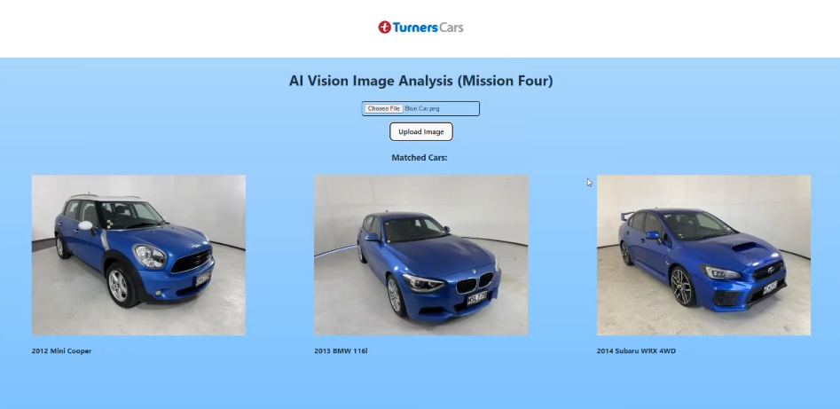

# Mission Ready Level 5 Mission Four Project 🚀

CLI MongoDB Seed Data Tool & Turners Cars Prototype: Building upon Mission 2, this project introduces a recommendation feature using MongoDB

# CLI MongoDB Seed Data Tool 🌱

A Command-Line Interface (CLI) tool has been created specifically for seeding data into a local MongoDB database or deleting existing data from it. This tool encompasses the management of seed data as well. See the "mission-04-cli" folder.

Commands:
- Add Car (a)
- Find Car (f)
- Update Car (u)
- Remove Car (r)
- List Cars (l)

# Turners Cars Prototype 🏎️
When users upload car images, the backend uses Azure AI Vision for image analysis. It then displays multiple images of similar cars with matching colors. MongoDB serves as the data repository for each car, storing information such as images, model names, years, and colors.

Technologies used include:
Frontend: React, HTML, CSS, JavaScript
Backend: Express.js
Database: MongoDB
Image Analysis: Microsoft Azure AI"

# Images 📷

